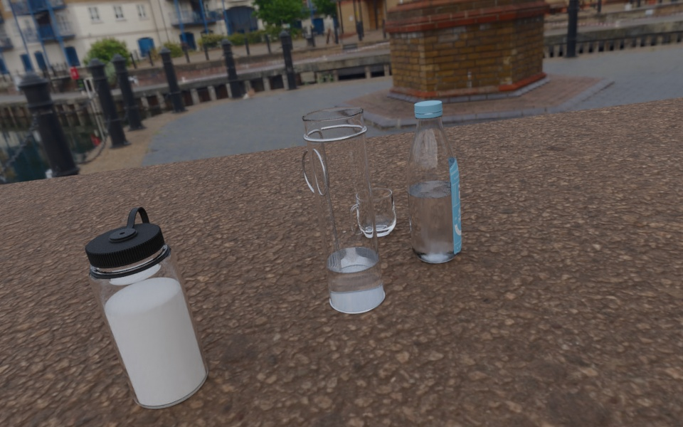
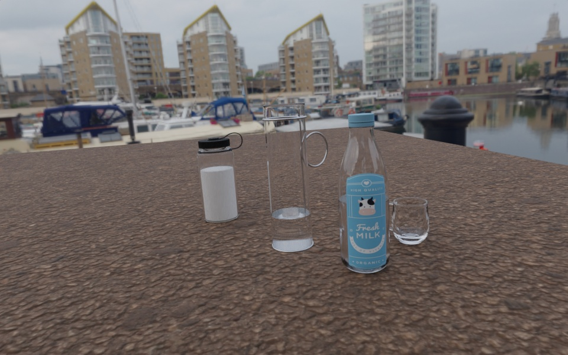

# SimLiquid: A Simulation-Based Liquid Perception Pipeline for Robot Liquid Manipulation

## Liquid Dataset Render

### 🛠️ Environment Setup

Use conda or mamba to create a new environment and activate it:
```Bash
conda create -n liquid python=3.10
conda activate liquid
```

Install BlenderProc and download assets
```BASH
pip install git+https://github.com/DLR-RM/BlenderProc.git
blenderproc pip install tqdm
mkdir -p  assets/haven && cd assets/haven
blenderproc download haven .
cd ../.. && mkdir blender_projs
```

Download the [blender project](https://www.dropbox.com/scl/fi/diow2d4oddhvkim418xow/liquids.blend?rlkey=ypkz5afsyjvab4pyso711kxvi&st=3aekonvf&dl=0) and save it as  `blender_projs/liquids.blend`

#### Project Structure
```
SimLquid
├── liquid_render
│   ├── blender_projs
│   │   ├── liquids.blend
│   ├── assets
│   │   ├── haven
│   ├── cfgs
│   │   ├── liquid.yaml
│   ├── liquid_render.py
│   ├── render.sh
├── README.md

```


### 🚀 Render Dataset
```
./render.sh
```

#### Example images:



